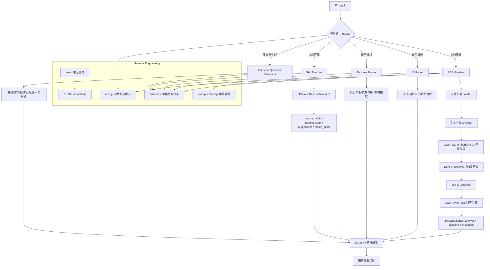
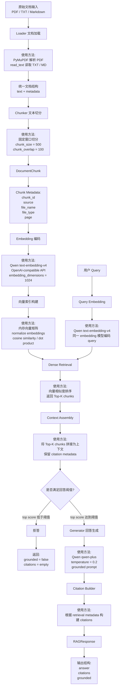

# OfferMate-RAG：面向岗位 JD 与技术文档的检索增强智能助手

OfferMate-RAG 是一个面向岗位 JD、简历与技术文档场景的智能求职助手项目，以 **RAG（Retrieval-Augmented Generation）** 为核心，以 **Agent Workflow + Tool Calling** 为增强，并引入 **Harness Engineering** 思路，通过模块边界、Schema 约束、Prompt 模板管理、配置中心、测试与 CI 质量门禁，将 AI 能力收敛为可控、可复现、可交付的工程流程。

本项目面向大模型应用与 AI 工程场景，重点关注：  
**文档问答、岗位解析、简历解析、技能匹配、面试题生成、工程约束与系统可维护性。**

---

## 1. 项目目标

本项目旨在构建一个面向求职场景的检索增强智能助手，支持以下能力：

- 基于岗位 JD、简历与技术文档进行问答
- 输出带引用的可信回答
- 对用户请求进行任务路由，并调用对应工具模块
- 解析岗位要求与简历内容，完成技能匹配分析
- 根据岗位与简历生成针对性面试问题
- 通过 Harness Engineering 降低 AI 系统输出的不确定性，提升可控性与可维护性

---

## 2. 核心特性

### 2.1 RAG 主链路

- 支持 PDF / TXT / Markdown 文档加载
- 支持文本 chunk 切分
- 使用 Qwen `text-embedding-v4` 构建向量检索
- 使用 Qwen `qwen-plus` 生成回答
- 支持 citation-aware answer
- 支持基础拒答机制
- 返回结构化 `RAGResponse`

### 2.2 Agent Workflow

- 支持 config-driven priority router
- 支持根据用户请求路由到不同任务路径
- 当前支持任务类型：
  - RAG 问答
  - JD Parser
  - Resume Parser
  - Skill Matcher
  - Interview Question Generator

### 2.3 Tool Calling

当前已实现规则版工具模块：

- `JD Parser`：抽取岗位技能、学历要求、实习时长、职责描述
- `Resume Parser`：抽取简历技能、教育背景、项目、奖项
- `Skill Matcher`：对比 JD 与简历，输出匹配技能、缺失技能、建议补充项和匹配分数
- `Interview Question Generator`：基于岗位要求、简历内容和技能差距生成分类型面试问题

### 2.4 Harness Engineering

本项目不仅关注 AI 功能本身，也关注 AI 系统的稳定交付。当前通过以下方式体现 Harness Engineering：

- 模块化架构：`rag / agent / tools / schemas / prompts / config / harness / tests`
- Schema 约束：使用 Pydantic 固定核心输入输出结构
- Prompt 外置：将 prompt 模板从代码中分离
- 配置中心：统一管理模型、检索、回答、路由等配置
- 测试体系：使用 PyTest 对核心模块进行基础测试
- CI 质量门禁：使用 GitHub Actions 执行基础测试流程

---

## 3. 系统整体流程图



---

## 4. RAG 模块流程图



---

## 5. RAG 模块方法说明

| 模块 | 文件 | 当前方法 | 说明 |
|---|---|---|---|
| 文档加载 | `rag/loader.py` | PyMuPDF + 本地文本读取 | PDF 使用 PyMuPDF，TXT/MD 使用 `read_text` |
| 文本切分 | `rag/chunker.py` | 固定窗口切分 | 使用 `chunk_size` 和 `chunk_overlap` 控制切分粒度 |
| Chunk Schema | `schemas/document.py` | Pydantic Schema | 统一 chunk 输出结构，保留 source、file_name、page 等元数据 |
| Embedding | `rag/retriever.py` | Qwen `text-embedding-v4` | 使用 Qwen embedding 模型对 chunk 和 query 编码 |
| 检索 | `rag/retriever.py` | Dense Retrieval | 当前使用向量相似度检索，返回 Top-K chunks |
| 生成 | `rag/generator.py` | Qwen `qwen-plus` | 基于检索上下文生成回答 |
| 引用构建 | `rag/pipeline.py` | metadata-based citation | 根据检索结果的 source、file_name、page、chunk_id 构建引用 |
| 拒答机制 | `rag/pipeline.py` + `config/answer.yaml` | score threshold | 当 top score 低于阈值时返回拒答 |
| 输出结构 | `schemas/common.py` | `RAGResponse` | 返回 answer、citations、grounded |

---

## 6. 当前进度

### 已完成

- [x] 项目初始化
- [x] 基础目录结构搭建
- [x] FastAPI 最小后端启动
- [x] Streamlit 最小前端启动
- [x] Agent / Tools 模块骨架
- [x] Schema 约束层初版
- [x] Prompt 模板目录初版
- [x] Config 配置目录初版
- [x] 文档加载模块 `loader.py`
- [x] 文本切分模块 `chunker.py`
- [x] `load -> chunk` 最小 pipeline
- [x] Qwen Embedding 接入（`text-embedding-v4`）
- [x] Qwen Generation 接入（`qwen-plus`）
- [x] 最小 retrieval pipeline
- [x] 回答结构化输出（`RAGResponse` / `Citation`）
- [x] 基础拒答机制（score threshold）
- [x] 引用构建逻辑
- [x] 最小 `/chat` API
- [x] Streamlit 问答演示页
- [x] Config-driven priority router
- [x] JD Parser 规则版
- [x] Resume Parser 规则版
- [x] Skill Matcher 规则版
- [x] Interview Question Generator 增强规则版
- [x] Agent Tool Registry
- [x] Agent Workflow 初版
- [x] Streamlit 支持 RAG 问答、JD/简历匹配、面试题生成
- [x] 基础 Harness Checks
- [x] GitHub Actions CI 初版

### 开发中

- [ ] BM25 检索
- [ ] Hybrid Retrieval
- [ ] Reranker
- [ ] Benchmark / Regression Harness
- [ ] LLM Router Fallback
- [ ] Qwen-based Tool Generation
- [ ] 更完整的端到端 Agent Workflow

---

## 7. 项目结构

```text
offermate-rag/
├── app/                          # 前端展示层（Streamlit）
│   └── main.py
├── backend/                      # API 层（FastAPI）
│   └── main.py
├── rag/                          # RAG 主链路
│   ├── loader.py                 # 文档加载
│   ├── chunker.py                # 文本切分
│   ├── retriever.py              # Qwen embedding 检索
│   ├── generator.py              # Qwen generation 回答生成
│   └── pipeline.py               # retrieval -> answer 主流程
├── agent/                        # Agent 路由与流程编排
│   ├── router.py                 # priority-based router
│   ├── registry.py               # tool registry
│   └── workflow.py               # agent workflow
├── tools/                        # 可被 agent 调用的工具模块
│   ├── jd_parser.py
│   ├── resume_parser.py
│   ├── skill_matcher.py
│   └── interview_generator.py
├── schemas/                      # 统一输入输出约束
│   ├── common.py
│   ├── jd.py
│   ├── resume.py
│   ├── match.py
│   ├── document.py
│   └── retrieval.py
├── prompts/                      # Prompt 模板管理
│   ├── rag_answer.txt
│   ├── router.txt
│   ├── jd_parser.txt
│   └── resume_parser.txt
├── config/                       # 配置中心
│   ├── settings.py
│   ├── retrieval.yaml
│   ├── workflow.yaml
│   ├── model.yaml
│   └── answer.yaml
├── harness/                      # Harness Engineering 相关检查与验证
│   ├── checks/
│   │   ├── schema_check.py
│   │   └── route_check.py
│   ├── eval/
│   └── runner.py
├── tests/                        # 测试层
│   ├── unit/
│   └── integration/
├── data/                         # 原始输入数据
│   ├── jd/
│   ├── resume/
│   ├── tech_docs/
│   └── interview/
├── docs/
├── screenshots/
├── .github/
│   └── workflows/
│       └── ci.yml
├── README.md
├── requirements.txt
└── .gitignore
```

---

## 8. 技术栈

### 大模型 / RAG

- Qwen Embedding: `text-embedding-v4`
- Qwen Generation: `qwen-plus`
- Dense Retrieval
- Prompt Engineering
- Citation-Grounded Answering

### Agent / Workflow

- Config-driven Router
- Priority-based Routing
- Tool Calling
- Rule-based Tools
- Agent Workflow

### 后端与前端

- Python
- FastAPI
- Streamlit

### 工程与质量

- Pydantic
- PyTest
- Git / GitHub
- GitHub Actions CI
- YAML Config

### 文档处理

- PyMuPDF
- TXT / Markdown / PDF 文档加载

---

## 9. 快速开始

### 9.1 创建环境

推荐使用 Python 3.10。

```bash
python -m venv .venv
```

Windows 激活：

```bash
.venv\Scripts\activate
```

Linux / Mac 激活：

```bash
source .venv/bin/activate
```

---

### 9.2 安装依赖

```bash
pip install -r requirements.txt
```

---

### 9.3 配置环境变量

Windows PowerShell：

```bash
$env:DASHSCOPE_API_KEY="你的APIKey"
```

Linux / Mac：

```bash
export DASHSCOPE_API_KEY="你的APIKey"
```

---

### 9.4 启动前端

```bash
streamlit run app/main.py
```

---

### 9.5 启动后端，可选

```bash
uvicorn backend.main:app --reload
```

默认访问：

```text
http://127.0.0.1:8000
```

---

## 10. 数据准备

将原始数据放入以下目录：

- `data/jd/`：岗位 JD
- `data/resume/`：简历 PDF / TXT
- `data/tech_docs/`：技术文档、学习笔记
- `data/interview/`：面试题、面经、八股资料

当前支持的文档类型：

- `.txt`
- `.md`
- `.pdf`

建议至少准备：

- 1 份岗位 JD
- 1 份简历
- 1 份技术文档
- 1 份面试题资料

---

## 11. 使用方式

### 11.1 RAG 问答

在 Streamlit 的 `RAG 问答` tab 中输入问题，例如：

```text
这个岗位主要要求哪些技能？
```

该模块会调用：

- Qwen `text-embedding-v4`
- Qwen `qwen-plus`

因此会消耗 token。

---

### 11.2 JD / 简历匹配

在 `JD/简历匹配` tab 中分别输入岗位 JD 和简历文本。

输出包括：

- 岗位解析结果
- 简历解析结果
- 匹配技能
- 缺失技能
- 修改建议
- 匹配分数

该模块当前为规则版工具，不调用 Qwen，不消耗 token。

---

### 11.3 面试题生成

在 `面试题生成` tab 中输入岗位 JD 和简历文本。

输出包括：

- 基础问题
- 技能问题
- 差距追问
- 项目问题

该模块当前为规则版工具，不调用 Qwen，不消耗 token。

---

## 12. 示例检查方式

### 12.1 检查完整问答流程

```python
from rag.pipeline import answer_query

result = answer_query("这个岗位主要要求哪些技能？", "data", top_k=3)
print(result.model_dump())
```

注意：该流程会调用 Qwen Embedding 与 Qwen Generation，会消耗 token。

---

### 12.2 检查 Router

```python
from agent.router import route_query

print(route_query("帮我分析我的简历和这个岗位是否匹配"))
print(route_query("根据我的简历和岗位 JD 生成面试题"))
print(route_query("帮我解析这份简历"))
```

该流程不调用 Qwen，不消耗 token。

---

### 12.3 检查 Skill Matcher

```python
from tools.skill_matcher import match_skills

jd_text = "岗位要求：熟悉 Python、RAG、FastAPI、Docker。"
resume_text = "技能：Python, RAG, FastAPI。"

result = match_skills(jd_text, resume_text)
print(result.model_dump())
```

该流程不调用 Qwen，不消耗 token。

---

### 12.4 运行单元测试

```bash
pytest tests/unit -v
```

单元测试主要验证 schema、loader、chunker、router、tools、answer logic 等本地逻辑，默认不调用 Qwen，不消耗 token。

---

## 13. Harness Engineering 设计说明

### 13.1 架构级约束

通过以下目录划分系统职责：

- `rag/`：负责文档问答主链路
- `agent/`：负责路由和工具编排
- `tools/`：负责具体可调用工具
- `schemas/`：负责输入输出结构约束
- `prompts/`：负责 prompt 模板管理
- `config/`：负责系统行为配置
- `tests/`：负责核心逻辑验证
- `harness/`：负责质量检查与后续评测

---

### 13.2 质量级约束

项目通过以下方式降低 AI 系统不确定性：

- Pydantic Schema 约束结构化输出
- Prompt 模板外置，避免散落在代码中
- Router 规则配置化，避免硬编码
- 单元测试覆盖核心本地逻辑
- 后续计划增加 benchmark / regression harness

---

### 13.3 流程级约束

项目通过以下方式增强可维护性：

- 使用 `config/*.yaml` 管理参数
- 使用 Git 记录开发过程
- 使用 GitHub Actions 执行基础 CI
- 后续计划引入更完整的 checks 与 regression tests

---

## 14. 当前限制与后续优化

### 14.1 Router 仍是规则版

当前 router 已支持 priority-based routing，但本质上仍是规则路由。

后续计划：

- 引入 scoring router
- 支持规则置信度计算
- 当规则置信度较低时，调用 Qwen 做 LLM router fallback
- 支持复杂任务的 multi-step planner

---

### 14.2 Tools 当前为规则版

当前 JD Parser、Resume Parser、Skill Matcher、Interview Question Generator 均为规则版。

优点：

- 稳定
- 可测试
- 不消耗 token
- 工程可控

限制：

- 对自然语言表达泛化能力有限
- 对复杂 JD / 简历解析能力较弱
- 面试题生成仍偏模板化

后续计划：

- 引入 Qwen-based JD Parser
- 引入 Qwen-based Resume Parser
- 引入 Qwen-based Interview Question Generator
- 保留 rule-based tools 作为低成本稳定 baseline

---

### 14.3 检索模块仍是 Dense Retrieval

当前检索模块仅支持 Qwen Embedding + Dense Retrieval。

后续计划：

- 接入 BM25
- 接入 Hybrid Retrieval
- 接入 Reranker
- 构建 retrieval benchmark
- 输出 Recall@K / MRR 等指标

---

## 15. 后续开发计划

### 阶段一：完善工具链

- 优化 JD Parser
- 优化 Resume Parser
- 优化 Skill Matcher
- 优化 Interview Question Generator

### 阶段二：增强 Agent Workflow

- Scoring Router
- LLM Router Fallback
- Multi-step Planner
- 工具调用结果校验

### 阶段三：增强 RAG 检索质量

- BM25
- Hybrid Retrieval
- Reranker
- Retrieval Evaluation

### 阶段四：补强 Harness Engineering

- Schema checks
- Prompt checks
- Tool contract checks
- Regression benchmark
- CI quality gate

### 阶段五：增强展示能力

- 增加 demo screenshots
- 增加 sample data
- 增加项目架构图
- 增加部署说明

---

## 16. 项目价值

相比普通的 RAG Demo，本项目更强调：

- 场景化：围绕岗位 JD、简历与技术文档的真实求职场景设计
- 工程化：通过模块划分、Schema、配置、测试与 CI 提高可维护性
- 可控性：通过 Harness Engineering 思路约束 AI 输出行为
- 可扩展性：通过 Agent Router 与 Tools 结构支持多任务扩展
- 可展示性：兼具 GitHub 项目展示、简历项目描述与面试讲解价值

---

## 17. License

当前仅用于个人学习、项目展示与求职场景实践，后续可根据需要补充正式 License。